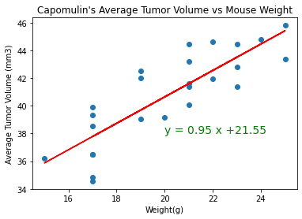

# Data Analysis: Pymaceuticals

### Observations and Insights 

• The animal study had a sample of 249 mice (124 females and 125 males). One mouse had duplicate data; thus, it was expelled. The data analysis was performed from the data collected from 248 mice. The gender distribution for this study was 50.4% male and 49.6% female. 

• Overall, there were 10 treatment regimens used for the animal study. However, four of these (Capomulin, Ceftamin, Infubinol, and Ramicane) were identified as promising treatments.

• The average tumor volumes were significantly low for the mice treated with Capomulin and Ramicane, indicating that these two treatments where the most effective in reducing the size of the tumors of the mice. 

• For the Final Tumor Volume per Drug Regimen, there was one outlier identified in the box plot for Infubinol. 

• The correlation between mouse weight, and average tumor volume is 0.84. This number is considered a strong positive correlation which indicates that when the mouse weight increases the average tumor volume also increases. 


```python
# Dependencies and Setup
import matplotlib.pyplot as plt
import pandas as pd
import scipy.stats as st
import numpy as np


#Read CSV file 
mouse_metadata = pd.read_csv("Data/mouse_metadata.csv")
study_results = pd.read_csv("Data/study_results.csv")
```


```python
mouse_metadata.head()
```


<div>
<style scoped>
    .dataframe tbody tr th:only-of-type {
        vertical-align: middle;
    }

    .dataframe tbody tr th {
        vertical-align: top;
    }

    .dataframe thead th {
        text-align: right;
    }
</style>
<table border="1" class="dataframe">
  <thead>
    <tr style="text-align: right;">
      <th></th>
      <th>Mouse ID</th>
      <th>Drug Regimen</th>
      <th>Sex</th>
      <th>Age_months</th>
      <th>Weight (g)</th>
    </tr>
  </thead>
  <tbody>
    <tr>
      <th>0</th>
      <td>k403</td>
      <td>Ramicane</td>
      <td>Male</td>
      <td>21</td>
      <td>16</td>
    </tr>
    <tr>
      <th>1</th>
      <td>s185</td>
      <td>Capomulin</td>
      <td>Female</td>
      <td>3</td>
      <td>17</td>
    </tr>
    <tr>
      <th>2</th>
      <td>x401</td>
      <td>Capomulin</td>
      <td>Female</td>
      <td>16</td>
      <td>15</td>
    </tr>
    <tr>
      <th>3</th>
      <td>m601</td>
      <td>Capomulin</td>
      <td>Male</td>
      <td>22</td>
      <td>17</td>
    </tr>
    <tr>
      <th>4</th>
      <td>g791</td>
      <td>Ramicane</td>
      <td>Male</td>
      <td>11</td>
      <td>16</td>
    </tr>
  </tbody>
</table>
</div>


```python
study_results.head()
```


<div>
<style scoped>
    .dataframe tbody tr th:only-of-type {
        vertical-align: middle;
    }

    .dataframe tbody tr th {
        vertical-align: top;
    }

    .dataframe thead th {
        text-align: right;
    }
</style>
<table border="1" class="dataframe">
  <thead>
    <tr style="text-align: right;">
      <th></th>
      <th>Mouse ID</th>
      <th>Timepoint</th>
      <th>Tumor Volume (mm3)</th>
      <th>Metastatic Sites</th>
    </tr>
  </thead>
  <tbody>
    <tr>
      <th>0</th>
      <td>b128</td>
      <td>0</td>
      <td>45.0</td>
      <td>0</td>
    </tr>
    <tr>
      <th>1</th>
      <td>f932</td>
      <td>0</td>
      <td>45.0</td>
      <td>0</td>
    </tr>
    <tr>
      <th>2</th>
      <td>g107</td>
      <td>0</td>
      <td>45.0</td>
      <td>0</td>
    </tr>
    <tr>
      <th>3</th>
      <td>a457</td>
      <td>0</td>
      <td>45.0</td>
      <td>0</td>
    </tr>
    <tr>
      <th>4</th>
      <td>c819</td>
      <td>0</td>
      <td>45.0</td>
      <td>0</td>
    </tr>
  </tbody>
</table>
</div>


```python
# Combine the data into a single dataset
combined_data = pd.merge(study_results, mouse_metadata, how="left", on="Mouse ID") 

# Display the data table for preview
combined_data.head()
```


<div>
<style scoped>
    .dataframe tbody tr th:only-of-type {
        vertical-align: middle;
    }

    .dataframe tbody tr th {
        vertical-align: top;
    }

    .dataframe thead th {
        text-align: right;
    }
</style>
<table border="1" class="dataframe">
  <thead>
    <tr style="text-align: right;">
      <th></th>
      <th>Mouse ID</th>
      <th>Timepoint</th>
      <th>Tumor Volume (mm3)</th>
      <th>Metastatic Sites</th>
      <th>Drug Regimen</th>
      <th>Sex</th>
      <th>Age_months</th>
      <th>Weight (g)</th>
    </tr>
  </thead>
  <tbody>
    <tr>
      <th>0</th>
      <td>b128</td>
      <td>0</td>
      <td>45.0</td>
      <td>0</td>
      <td>Capomulin</td>
      <td>Female</td>
      <td>9</td>
      <td>22</td>
    </tr>
    <tr>
      <th>1</th>
      <td>f932</td>
      <td>0</td>
      <td>45.0</td>
      <td>0</td>
      <td>Ketapril</td>
      <td>Male</td>
      <td>15</td>
      <td>29</td>
    </tr>
    <tr>
      <th>2</th>
      <td>g107</td>
      <td>0</td>
      <td>45.0</td>
      <td>0</td>
      <td>Ketapril</td>
      <td>Female</td>
      <td>2</td>
      <td>29</td>
    </tr>
    <tr>
      <th>3</th>
      <td>a457</td>
      <td>0</td>
      <td>45.0</td>
      <td>0</td>
      <td>Ketapril</td>
      <td>Female</td>
      <td>11</td>
      <td>30</td>
    </tr>
    <tr>
      <th>4</th>
      <td>c819</td>
      <td>0</td>
      <td>45.0</td>
      <td>0</td>
      <td>Ketapril</td>
      <td>Male</td>
      <td>21</td>
      <td>25</td>
    </tr>
  </tbody>
</table>
</div>


```python
# Checking the number of mice.
mice_count = len(combined_data["Mouse ID"].unique())
mice_count
```


    249


```python
# Getting the duplicate mice by ID number that shows up for Mouse ID and Timepoint. 
duplicate_mouse = combined_data.loc[combined_data.duplicated(subset=["Mouse ID", "Timepoint"]), "Mouse ID"].unique()
duplicate_mouse
```


    array(['g989'], dtype=object)


###### Mouse ID g989 has duplicate data.


```python
# Optional: Get all the data for the duplicate mouse ID. 
mouse_g989 = combined_data[combined_data["Mouse ID"] == 'g989'] 
mouse_g989
```


<div>
<style scoped>
    .dataframe tbody tr th:only-of-type {
        vertical-align: middle;
    }

    .dataframe tbody tr th {
        vertical-align: top;
    }

    .dataframe thead th {
        text-align: right;
    }
</style>
<table border="1" class="dataframe">
  <thead>
    <tr style="text-align: right;">
      <th></th>
      <th>Mouse ID</th>
      <th>Timepoint</th>
      <th>Tumor Volume (mm3)</th>
      <th>Metastatic Sites</th>
      <th>Drug Regimen</th>
      <th>Sex</th>
      <th>Age_months</th>
      <th>Weight (g)</th>
    </tr>
  </thead>
  <tbody>
    <tr>
      <th>107</th>
      <td>g989</td>
      <td>0</td>
      <td>45.000000</td>
      <td>0</td>
      <td>Propriva</td>
      <td>Female</td>
      <td>21</td>
      <td>26</td>
    </tr>
    <tr>
      <th>137</th>
      <td>g989</td>
      <td>0</td>
      <td>45.000000</td>
      <td>0</td>
      <td>Propriva</td>
      <td>Female</td>
      <td>21</td>
      <td>26</td>
    </tr>
    <tr>
      <th>329</th>
      <td>g989</td>
      <td>5</td>
      <td>48.786801</td>
      <td>0</td>
      <td>Propriva</td>
      <td>Female</td>
      <td>21</td>
      <td>26</td>
    </tr>
    <tr>
      <th>360</th>
      <td>g989</td>
      <td>5</td>
      <td>47.570392</td>
      <td>0</td>
      <td>Propriva</td>
      <td>Female</td>
      <td>21</td>
      <td>26</td>
    </tr>
    <tr>
      <th>620</th>
      <td>g989</td>
      <td>10</td>
      <td>51.745156</td>
      <td>0</td>
      <td>Propriva</td>
      <td>Female</td>
      <td>21</td>
      <td>26</td>
    </tr>
    <tr>
      <th>681</th>
      <td>g989</td>
      <td>10</td>
      <td>49.880528</td>
      <td>0</td>
      <td>Propriva</td>
      <td>Female</td>
      <td>21</td>
      <td>26</td>
    </tr>
    <tr>
      <th>815</th>
      <td>g989</td>
      <td>15</td>
      <td>51.325852</td>
      <td>1</td>
      <td>Propriva</td>
      <td>Female</td>
      <td>21</td>
      <td>26</td>
    </tr>
    <tr>
      <th>869</th>
      <td>g989</td>
      <td>15</td>
      <td>53.442020</td>
      <td>0</td>
      <td>Propriva</td>
      <td>Female</td>
      <td>21</td>
      <td>26</td>
    </tr>
    <tr>
      <th>950</th>
      <td>g989</td>
      <td>20</td>
      <td>55.326122</td>
      <td>1</td>
      <td>Propriva</td>
      <td>Female</td>
      <td>21</td>
      <td>26</td>
    </tr>
    <tr>
      <th>1111</th>
      <td>g989</td>
      <td>20</td>
      <td>54.657650</td>
      <td>1</td>
      <td>Propriva</td>
      <td>Female</td>
      <td>21</td>
      <td>26</td>
    </tr>
    <tr>
      <th>1195</th>
      <td>g989</td>
      <td>25</td>
      <td>56.045564</td>
      <td>1</td>
      <td>Propriva</td>
      <td>Female</td>
      <td>21</td>
      <td>26</td>
    </tr>
    <tr>
      <th>1380</th>
      <td>g989</td>
      <td>30</td>
      <td>59.082294</td>
      <td>1</td>
      <td>Propriva</td>
      <td>Female</td>
      <td>21</td>
      <td>26</td>
    </tr>
    <tr>
      <th>1592</th>
      <td>g989</td>
      <td>35</td>
      <td>62.570880</td>
      <td>2</td>
      <td>Propriva</td>
      <td>Female</td>
      <td>21</td>
      <td>26</td>
    </tr>
  </tbody>
</table>
</div>


```python
# Create a clean DataFrame by dropping the duplicate mouse by its ID.
clean_data=combined_data[combined_data["Mouse ID"].isin(duplicate_mouse) == False]
clean_data.head()
```


<div>
<style scoped>
    .dataframe tbody tr th:only-of-type {
        vertical-align: middle;
    }

    .dataframe tbody tr th {
        vertical-align: top;
    }

    .dataframe thead th {
        text-align: right;
    }
</style>
<table border="1" class="dataframe">
  <thead>
    <tr style="text-align: right;">
      <th></th>
      <th>Mouse ID</th>
      <th>Timepoint</th>
      <th>Tumor Volume (mm3)</th>
      <th>Metastatic Sites</th>
      <th>Drug Regimen</th>
      <th>Sex</th>
      <th>Age_months</th>
      <th>Weight (g)</th>
    </tr>
  </thead>
  <tbody>
    <tr>
      <th>0</th>
      <td>b128</td>
      <td>0</td>
      <td>45.0</td>
      <td>0</td>
      <td>Capomulin</td>
      <td>Female</td>
      <td>9</td>
      <td>22</td>
    </tr>
    <tr>
      <th>1</th>
      <td>f932</td>
      <td>0</td>
      <td>45.0</td>
      <td>0</td>
      <td>Ketapril</td>
      <td>Male</td>
      <td>15</td>
      <td>29</td>
    </tr>
    <tr>
      <th>2</th>
      <td>g107</td>
      <td>0</td>
      <td>45.0</td>
      <td>0</td>
      <td>Ketapril</td>
      <td>Female</td>
      <td>2</td>
      <td>29</td>
    </tr>
    <tr>
      <th>3</th>
      <td>a457</td>
      <td>0</td>
      <td>45.0</td>
      <td>0</td>
      <td>Ketapril</td>
      <td>Female</td>
      <td>11</td>
      <td>30</td>
    </tr>
    <tr>
      <th>4</th>
      <td>c819</td>
      <td>0</td>
      <td>45.0</td>
      <td>0</td>
      <td>Ketapril</td>
      <td>Male</td>
      <td>21</td>
      <td>25</td>
    </tr>
  </tbody>
</table>
</div>


```python
# Checking the number of mice in the clean DataFrame.
mice_recount = len(clean_data["Mouse ID"].unique())
mice_recount
```


    248


## Summary Statistics


```python
# Generate a summary statistics table of mean, median, variance, standard deviation, and SEM of the tumor volume for each regimen
# Use groupby and summary statistical methods to calculate the following properties of each drug regimen: 
# mean, median, variance, standard deviation, and SEM of the tumor volume. 

mean = clean_data.groupby(["Drug Regimen"]).mean()["Tumor Volume (mm3)"]
median = clean_data.groupby(["Drug Regimen"]).median()["Tumor Volume (mm3)"]
var = clean_data.groupby(["Drug Regimen"]).var()["Tumor Volume (mm3)"]
std = clean_data.groupby(["Drug Regimen"]).std()["Tumor Volume (mm3)"]
sem = clean_data.groupby(["Drug Regimen"]).sem()["Tumor Volume (mm3)"]

# Assemble the resulting series into a single summary dataframe.
summary_stats = pd.DataFrame({"Mean": mean, "Median": median, "Variance": var, "Std Dev": std, "SEM": sem})
summary_stats.round(2)
```


<div>
<style scoped>
    .dataframe tbody tr th:only-of-type {
        vertical-align: middle;
    }

    .dataframe tbody tr th {
        vertical-align: top;
    }

    .dataframe thead th {
        text-align: right;
    }
</style>
<table border="1" class="dataframe">
  <thead>
    <tr style="text-align: right;">
      <th></th>
      <th>Mean</th>
      <th>Median</th>
      <th>Variance</th>
      <th>Std Dev</th>
      <th>SEM</th>
    </tr>
    <tr>
      <th>Drug Regimen</th>
      <th></th>
      <th></th>
      <th></th>
      <th></th>
      <th></th>
    </tr>
  </thead>
  <tbody>
    <tr>
      <th>Capomulin</th>
      <td>40.68</td>
      <td>41.56</td>
      <td>24.95</td>
      <td>4.99</td>
      <td>0.33</td>
    </tr>
    <tr>
      <th>Ceftamin</th>
      <td>52.59</td>
      <td>51.78</td>
      <td>39.29</td>
      <td>6.27</td>
      <td>0.47</td>
    </tr>
    <tr>
      <th>Infubinol</th>
      <td>52.88</td>
      <td>51.82</td>
      <td>43.13</td>
      <td>6.57</td>
      <td>0.49</td>
    </tr>
    <tr>
      <th>Ketapril</th>
      <td>55.24</td>
      <td>53.70</td>
      <td>68.55</td>
      <td>8.28</td>
      <td>0.60</td>
    </tr>
    <tr>
      <th>Naftisol</th>
      <td>54.33</td>
      <td>52.51</td>
      <td>66.17</td>
      <td>8.13</td>
      <td>0.60</td>
    </tr>
    <tr>
      <th>Placebo</th>
      <td>54.03</td>
      <td>52.29</td>
      <td>61.17</td>
      <td>7.82</td>
      <td>0.58</td>
    </tr>
    <tr>
      <th>Propriva</th>
      <td>52.32</td>
      <td>50.45</td>
      <td>43.85</td>
      <td>6.62</td>
      <td>0.54</td>
    </tr>
    <tr>
      <th>Ramicane</th>
      <td>40.22</td>
      <td>40.67</td>
      <td>23.49</td>
      <td>4.85</td>
      <td>0.32</td>
    </tr>
    <tr>
      <th>Stelasyn</th>
      <td>54.23</td>
      <td>52.43</td>
      <td>59.45</td>
      <td>7.71</td>
      <td>0.57</td>
    </tr>
    <tr>
      <th>Zoniferol</th>
      <td>53.24</td>
      <td>51.82</td>
      <td>48.53</td>
      <td>6.97</td>
      <td>0.52</td>
    </tr>
  </tbody>
</table>
</div>


```python
# Using the aggregation method, produce the same summary statistics in a single line
clean_data.groupby(["Drug Regimen"])["Tumor Volume (mm3)"].agg(['mean', 'median', 'var', 'std', 'sem']).round(2)
```


<div>
<style scoped>
    .dataframe tbody tr th:only-of-type {
        vertical-align: middle;
    }

    .dataframe tbody tr th {
        vertical-align: top;
    }

    .dataframe thead th {
        text-align: right;
    }
</style>
<table border="1" class="dataframe">
  <thead>
    <tr style="text-align: right;">
      <th></th>
      <th>mean</th>
      <th>median</th>
      <th>var</th>
      <th>std</th>
      <th>sem</th>
    </tr>
    <tr>
      <th>Drug Regimen</th>
      <th></th>
      <th></th>
      <th></th>
      <th></th>
      <th></th>
    </tr>
  </thead>
  <tbody>
    <tr>
      <th>Capomulin</th>
      <td>40.68</td>
      <td>41.56</td>
      <td>24.95</td>
      <td>4.99</td>
      <td>0.33</td>
    </tr>
    <tr>
      <th>Ceftamin</th>
      <td>52.59</td>
      <td>51.78</td>
      <td>39.29</td>
      <td>6.27</td>
      <td>0.47</td>
    </tr>
    <tr>
      <th>Infubinol</th>
      <td>52.88</td>
      <td>51.82</td>
      <td>43.13</td>
      <td>6.57</td>
      <td>0.49</td>
    </tr>
    <tr>
      <th>Ketapril</th>
      <td>55.24</td>
      <td>53.70</td>
      <td>68.55</td>
      <td>8.28</td>
      <td>0.60</td>
    </tr>
    <tr>
      <th>Naftisol</th>
      <td>54.33</td>
      <td>52.51</td>
      <td>66.17</td>
      <td>8.13</td>
      <td>0.60</td>
    </tr>
    <tr>
      <th>Placebo</th>
      <td>54.03</td>
      <td>52.29</td>
      <td>61.17</td>
      <td>7.82</td>
      <td>0.58</td>
    </tr>
    <tr>
      <th>Propriva</th>
      <td>52.32</td>
      <td>50.45</td>
      <td>43.85</td>
      <td>6.62</td>
      <td>0.54</td>
    </tr>
    <tr>
      <th>Ramicane</th>
      <td>40.22</td>
      <td>40.67</td>
      <td>23.49</td>
      <td>4.85</td>
      <td>0.32</td>
    </tr>
    <tr>
      <th>Stelasyn</th>
      <td>54.23</td>
      <td>52.43</td>
      <td>59.45</td>
      <td>7.71</td>
      <td>0.57</td>
    </tr>
    <tr>
      <th>Zoniferol</th>
      <td>53.24</td>
      <td>51.82</td>
      <td>48.53</td>
      <td>6.97</td>
      <td>0.52</td>
    </tr>
  </tbody>
</table>
</div>


## Bar and Pie Charts

### Bar Plot using Pandas


```python
# Generate a bar plot showing the total number of unique mice tested on each drug regimen using pandas.
bar_plot = clean_data.groupby('Drug Regimen').count()['Mouse ID']
bar_plot.plot.bar(figsize = (10,5), color = 'g', fontsize = 12)

# Optional formatting
plt.ylabel("Number of Mice Tested")
plt.title("Number of Mice per Drug Regimen", fontsize = 14)
plt.show()
```


```python
bar_plot.head()
```


    Drug Regimen
    Capomulin    230
    Ceftamin     178
    Infubinol    178
    Ketapril     188
    Naftisol     186
    Name: Mouse ID, dtype: int64


### Bar Plot using Pyplot


```python
# Generate a bar plot showing the total number of unique mice tested on each drug regimen using pyplot.

# Convert bar_plot into a list
bar_plot.tolist()

#Set the x_axis 
x_axis = np.arange(len(bar_plot))
x_axis = bar_plot.index

plt.bar(x_axis, bar_plot, color = 'green')

# Format bar chart
plt.xlabel("Drug Regimen")
plt.ylabel("Number of Mice Tested")
plt.title("Number of Mice per Drug Regimen", fontsize = 14)
plt.xticks(rotation=90)
plt.show()
```


```python
# Generate a pie plot showing the distribution of female versus male mice using pandas
drop_duplicate = mouse_metadata[mouse_metadata["Mouse ID"].isin(duplicate_mouse) == False]
gender = drop_duplicate['Sex'].value_counts()
sizes = gender.values 
labels = gender.values
gender.plot(kind="pie", colors = ['lightblue', 'pink'], explode=(0.1,0), autopct="%1.1f%%", shadow=True, startangle=90)

# Add title to chart, then display 
plt.title("Gender Distribution")
plt.ylabel(" ")
plt.show()
```


```python
# Generate a pie plot showing the distribution of female versus male mice using pyplot
drop_duplicate = mouse_metadata[mouse_metadata["Mouse ID"].isin(duplicate_mouse) == False]
gender_pie2 = drop_duplicate['Sex'].value_counts()


plt.pie(gender_pie2, labels = ["Male", "Female"], colors = ["lightblue", "pink"], explode=(0.1,0), autopct="%1.1f%%", shadow=True, startangle=90)

# Add title to chart, then display 
plt.title('Gender Distribution')
plt.axis('equal')
plt.show()
```


## Quartiles, Outliers and Boxplots


```python
# Calculate the final tumor volume of each mouse across four of the treatment regimens:  
# Capomulin, Ramicane, Infubinol, and Ceftamin
drug_list = clean_data[clean_data["Drug Regimen"].isin(["Capomulin", "Ramicane", "Infubinol", "Ceftamin"])]

# Start by getting the last (greatest) timepoint for each mouse
max_tp = drug_list.groupby('Mouse ID').max()['Timepoint']
max_tp.reset_index().head()
```


<div>
<style scoped>
    .dataframe tbody tr th:only-of-type {
        vertical-align: middle;
    }

    .dataframe tbody tr th {
        vertical-align: top;
    }

    .dataframe thead th {
        text-align: right;
    }
</style>
<table border="1" class="dataframe">
  <thead>
    <tr style="text-align: right;">
      <th></th>
      <th>Mouse ID</th>
      <th>Timepoint</th>
    </tr>
  </thead>
  <tbody>
    <tr>
      <th>0</th>
      <td>a203</td>
      <td>45</td>
    </tr>
    <tr>
      <th>1</th>
      <td>a251</td>
      <td>45</td>
    </tr>
    <tr>
      <th>2</th>
      <td>a275</td>
      <td>45</td>
    </tr>
    <tr>
      <th>3</th>
      <td>a411</td>
      <td>45</td>
    </tr>
    <tr>
      <th>4</th>
      <td>a444</td>
      <td>45</td>
    </tr>
  </tbody>
</table>
</div>


```python
# Merge this group df with the original dataframe to get the tumor volume at the last timepoint
tumor_vol = pd.merge(max_tp, clean_data, how="left", on =["Mouse ID", "Timepoint"])
tumor_vol.head()
```


<div>
<style scoped>
    .dataframe tbody tr th:only-of-type {
        vertical-align: middle;
    }

    .dataframe tbody tr th {
        vertical-align: top;
    }

    .dataframe thead th {
        text-align: right;
    }
</style>
<table border="1" class="dataframe">
  <thead>
    <tr style="text-align: right;">
      <th></th>
      <th>Mouse ID</th>
      <th>Timepoint</th>
      <th>Tumor Volume (mm3)</th>
      <th>Metastatic Sites</th>
      <th>Drug Regimen</th>
      <th>Sex</th>
      <th>Age_months</th>
      <th>Weight (g)</th>
    </tr>
  </thead>
  <tbody>
    <tr>
      <th>0</th>
      <td>a203</td>
      <td>45</td>
      <td>67.973419</td>
      <td>2</td>
      <td>Infubinol</td>
      <td>Female</td>
      <td>20</td>
      <td>23</td>
    </tr>
    <tr>
      <th>1</th>
      <td>a251</td>
      <td>45</td>
      <td>65.525743</td>
      <td>1</td>
      <td>Infubinol</td>
      <td>Female</td>
      <td>21</td>
      <td>25</td>
    </tr>
    <tr>
      <th>2</th>
      <td>a275</td>
      <td>45</td>
      <td>62.999356</td>
      <td>3</td>
      <td>Ceftamin</td>
      <td>Female</td>
      <td>20</td>
      <td>28</td>
    </tr>
    <tr>
      <th>3</th>
      <td>a411</td>
      <td>45</td>
      <td>38.407618</td>
      <td>1</td>
      <td>Ramicane</td>
      <td>Male</td>
      <td>3</td>
      <td>22</td>
    </tr>
    <tr>
      <th>4</th>
      <td>a444</td>
      <td>45</td>
      <td>43.047543</td>
      <td>0</td>
      <td>Ramicane</td>
      <td>Female</td>
      <td>10</td>
      <td>25</td>
    </tr>
  </tbody>
</table>
</div>


```python
# Put treatments into a list for for loop (and later for plot labels)
drug_list = ['Capomulin', 'Ramicane', 'Infubinol', 'Ceftamin']
              
# Create empty list to fill with tumor vol data (for plotting)
vol_data = []
    
# Calculate the IQR and quantitatively determine if there are any potential outliers. 
 
    # Locate the rows which contain mice on each drug and get the tumor volumes
for drug in drug_list:
    drug_tumor_vol = tumor_vol['Tumor Volume (mm3)'].loc[tumor_vol['Drug Regimen'] == drug]

    # add subset 
    vol_data.append(drug_tumor_vol)
    
    # Determine outliers using upper and lower bounds

    quartiles = drug_tumor_vol.quantile([.25,.5,.75])
    lowerq = (quartiles[0.25]).round()
    upperq = (quartiles[0.75]).round()
    iqr = (upperq-lowerq).round()
    print(f'For {drug}, Interquartile Range (IQR) is {iqr}.')
   
    lower_bound = (lowerq - (1.5*iqr))
    upper_bound = (upperq + (1.5*iqr))
    print(f'For {drug}, values below {lower_bound} is considered an outlier.')
    print(f'For {drug}, values above {upper_bound}  is considered an outlier.\n')

```

    For Capomulin, Interquartile Range (IQR) is 8.0.
    For Capomulin, values below 20.0 is considered an outlier.
    For Capomulin, values above 52.0  is considered an outlier.
    
    For Ramicane, Interquartile Range (IQR) is 9.0.
    For Ramicane, values below 18.5 is considered an outlier.
    For Ramicane, values above 54.5  is considered an outlier.
    
    For Infubinol, Interquartile Range (IQR) is 12.0.
    For Infubinol, values below 36.0 is considered an outlier.
    For Infubinol, values above 84.0  is considered an outlier.
    
    For Ceftamin, Interquartile Range (IQR) is 15.0.
    For Ceftamin, values below 26.5 is considered an outlier.
    For Ceftamin, values above 86.5  is considered an outlier.
    
    


```python
# Generate a box plot of the final tumor volume of each mouse across four regimens of interest
# Format the outliers 
diamond = dict(markerfacecolor='r', marker='D', markersize=12)
# Plot
fig, ax = plt.subplots()
ax.set_title('Final Tumor Volume per Drug Regimen')
ax.set_xticklabels(drug_list)
ax.set_ylabel('Tumor Volume (mm3)')
ax.boxplot(vol_data, flierprops = diamond)
plt.show() 
```


## Line and Scatter Plots


```python
# Generate a line plot of tumor volume vs. time point for a mouse treated with Capomulin

# Select a mouse that was treated with Capomulin 
candidate = clean_data.loc[clean_data["Drug Regimen"] == "Capomulin"]    
#Select randomly using sample() without parameters
candidate.sample()
```


<div>
<style scoped>
    .dataframe tbody tr th:only-of-type {
        vertical-align: middle;
    }

    .dataframe tbody tr th {
        vertical-align: top;
    }

    .dataframe thead th {
        text-align: right;
    }
</style>
<table border="1" class="dataframe">
  <thead>
    <tr style="text-align: right;">
      <th></th>
      <th>Mouse ID</th>
      <th>Timepoint</th>
      <th>Tumor Volume (mm3)</th>
      <th>Metastatic Sites</th>
      <th>Drug Regimen</th>
      <th>Sex</th>
      <th>Age_months</th>
      <th>Weight (g)</th>
    </tr>
  </thead>
  <tbody>
    <tr>
      <th>940</th>
      <td>r554</td>
      <td>20</td>
      <td>36.015589</td>
      <td>2</td>
      <td>Capomulin</td>
      <td>Female</td>
      <td>8</td>
      <td>17</td>
    </tr>
  </tbody>
</table>
</div>


######  By random selection Mouse ID 'j119' was selected during initial 'run' code. 


```python
# Pull data of timepoint and tumor volume for Mouse ID 'j119'
mouse_j119 = clean_data[['Timepoint', 'Tumor Volume (mm3)']] \
            .loc[(clean_data['Drug Regimen'] == 'Capomulin') & (clean_data['Mouse ID']=='j119')]
mouse_j119
```


<div>
<style scoped>
    .dataframe tbody tr th:only-of-type {
        vertical-align: middle;
    }

    .dataframe tbody tr th {
        vertical-align: top;
    }

    .dataframe thead th {
        text-align: right;
    }
</style>
<table border="1" class="dataframe">
  <thead>
    <tr style="text-align: right;">
      <th></th>
      <th>Timepoint</th>
      <th>Tumor Volume (mm3)</th>
    </tr>
  </thead>
  <tbody>
    <tr>
      <th>235</th>
      <td>0</td>
      <td>45.000000</td>
    </tr>
    <tr>
      <th>354</th>
      <td>5</td>
      <td>45.838998</td>
    </tr>
    <tr>
      <th>570</th>
      <td>10</td>
      <td>46.425366</td>
    </tr>
    <tr>
      <th>818</th>
      <td>15</td>
      <td>47.322984</td>
    </tr>
    <tr>
      <th>1009</th>
      <td>20</td>
      <td>48.158209</td>
    </tr>
    <tr>
      <th>1136</th>
      <td>25</td>
      <td>42.417166</td>
    </tr>
    <tr>
      <th>1441</th>
      <td>30</td>
      <td>43.013681</td>
    </tr>
    <tr>
      <th>1599</th>
      <td>35</td>
      <td>43.765705</td>
    </tr>
    <tr>
      <th>1673</th>
      <td>40</td>
      <td>44.585090</td>
    </tr>
    <tr>
      <th>1859</th>
      <td>45</td>
      <td>38.125164</td>
    </tr>
  </tbody>
</table>
</div>


```python
# Generate a line plot for Mouse ID 'j119'
plt.plot(mouse_j119['Timepoint'], mouse_j119['Tumor Volume (mm3)'], color="red", marker='o')
plt.title("Capomulin's Tumor Volume vs Timepoint in Mouse 'j119'")
plt.ylabel("Tumor Volume (mm3)")
plt.xlabel("Timepoint")
```


    Text(0.5, 0, 'Timepoint')


```python
# Generate a scatter plot of average tumor volume vs. mouse weight for the Capomulin regimen
weight = clean_data.loc[clean_data['Drug Regimen'] == 'Capomulin']
avg_vol = weight.groupby(["Mouse ID"]).mean()

plt.scatter(avg_vol["Weight (g)"],avg_vol["Tumor Volume (mm3)"], color="green", marker='x') 
plt.xlabel("Mouse Weight")
plt.ylabel("Tumor Volume (mm3)")
plt.title("Capomulin's Average Tumor Volume vs Mouse Weight")
plt.show()
```


## Correlation and Regression


```python
# Calculate the correlation coefficient and linear regression model 
# for mouse weight and average tumor volume for the Capomulin regimen
corr = round(st.pearsonr(avg_vol['Weight (g)'],avg_vol['Tumor Volume (mm3)'])[0],2)
print(f"The correlation between Mouse Weight (g) and Average Tumor Volume is {round(corr,2)}.")
```

    The correlation between Mouse Weight (g) and Average Tumor Volume is 0.84.
    


```python
# Plot the linear regression model on top of the previous scatter plot.
linear_reg = st.linregress(avg_vol['Weight (g)'],avg_vol['Tumor Volume (mm3)'])
linear_reg
```


    LinregressResult(slope=0.9544396890241045, intercept=21.552160532685015, rvalue=0.8419363424694718, pvalue=1.3225722434712642e-07, stderr=0.1275435903320134)


```python
slope = 0.9544396890241045
intercept = 21.552160532685015
```


```python
regress_values = avg_vol['Weight (g)'] * slope + intercept
regress_values.head()
```


    Mouse ID
    b128    42.549834
    b742    41.595394
    f966    37.777635
    g288    39.686515
    g316    42.549834
    Name: Weight (g), dtype: float64


```python
# Generate Linear Equation 
line_eq = "y = " + str(round(slope,2)) + " x +" + str(round(intercept,2))
print(f'The linear regression equation is {line_eq}.')
```

    The linear regression equation is y = 0.95 x +21.55.
    


```python
# Generate the plot 
plt.scatter(avg_vol['Weight (g)'],avg_vol['Tumor Volume (mm3)'])
plt.plot(avg_vol['Weight (g)'], regress_values, "-r", color='red')
plt.annotate(line_eq,(20,38), color='green', fontsize=14)
plt.xlabel('Weight(g)')
plt.ylabel('Average Tumor Volume (mm3)')
plt.title("Capomulin's Average Tumor Volume vs Mouse Weight")
plt.show() 
```




